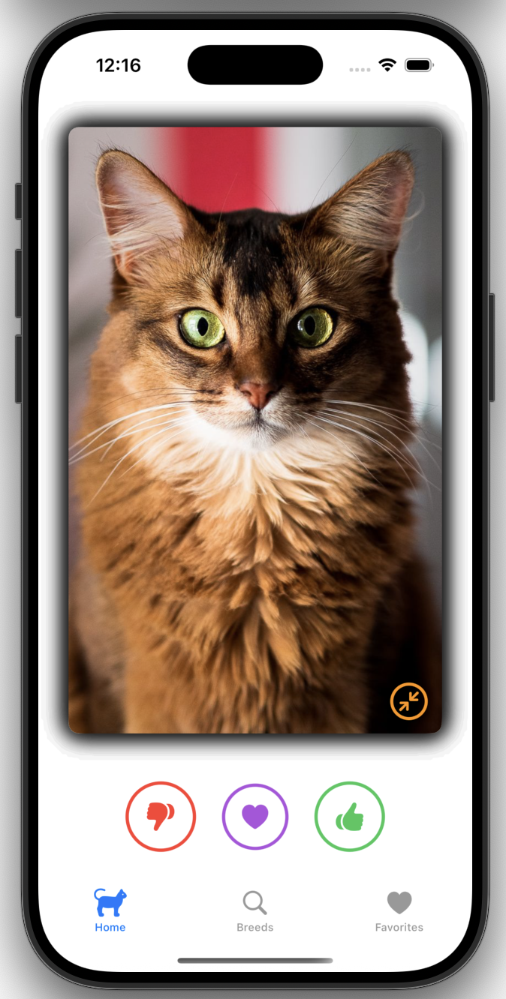
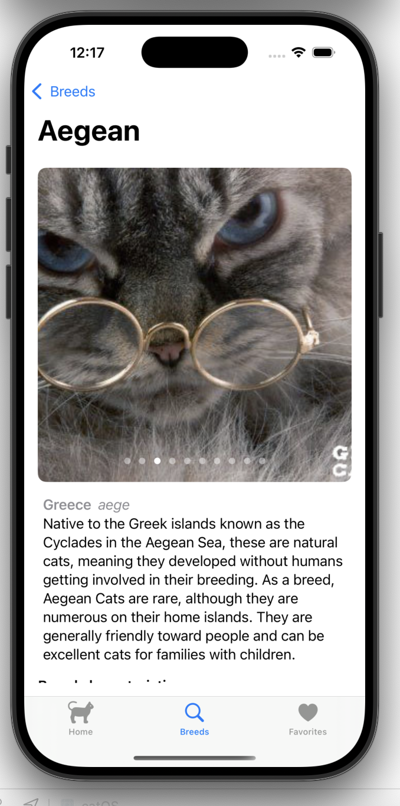
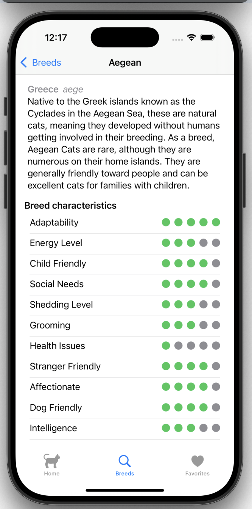
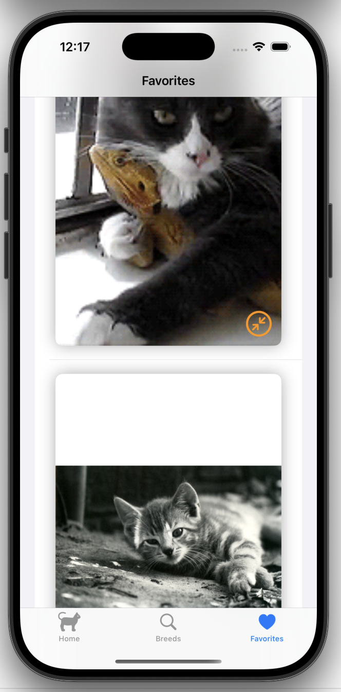

# Cat App 🐱

## APP UNDER CONSTRUCTION, NOT FINISHED YET

[](https://swift.org)
[](https://developer.apple.com/ios/)

A modern iOS app for cat enthusiasts, built with SwiftUI and Clean Architecture.
This project is intended for educational and portfolio purposes. All cat-related content and data belong to [TheCatAPI](https://thecatapi.com/) and this app is not officially affiliated with or endorsed by them.

## 📸 Screenshots

| Home | 
|------|
|  |

| Details | 
|------|
|  |
|  |

| Favorites |
|------|
|  |

## 🏗️ Architecture

### Clean Architecture Layers
```text
catOS/
├── App configuration
├── UI/ # SwiftUI Views
├── Presentation/ # ViewModels & UI state
├── Domain/ # Business logic
│   ├── Models/ # Core models
│   ├── UseCases/ # Business rules
│   └── Repositories/ # Protocol definitions
├── Data/ # Data layer
│   ├── DTOs/ # API data models
│   ├── Mappers/ # DTO ↔ Model conversion
│   └── Repositories/ # Concrete implementations
└── Infrastructure/ # Technical services
    └── Network/ # Network requests
```

### Key Patterns
- **MVVM** for UI separation
- **Repository Pattern** for data abstraction
- **Use Cases** for business logic encapsulation
- **Dependency Injection** for testability
- **SOLID Principles** throughout

## 🛠️ Technical Stack
- **100% SwiftUI**
- **Async/Await** for concurrency
- **Protocol-Oriented** design
- **Mappers** for clean API-Domain separation
- **Mockable Repositories** for unit testing
- **Dependency injection** making the code more modular, testable, and maintainable

## 🔄 Data Flow
    A ---|[View] -->|User Action| --> B[ViewModel]
    B -->|Calls| C[Use Case]
    C -->|Uses| D[Repository]
    D -->|Calls| E[API]
    E -->|Returns DTO| D
    D -->|Maps to Entity| C
    C -->|Returns Result| B
    B -->|Updates State| A


## 🚀 Getting Started

1. Clone the repo
2. Build with Xcode 15+
3. Run CatOS target
4. Configure your API key (recommended)

This project currently includes a demo API key for testing purposes.  
For better reliability and to avoid rate limits, it is recommended to use your own API key from https://thecatapi.com/.

After creating your key, replace the `API_KEY` value in the project's `.plist` configuration file with your own key.
